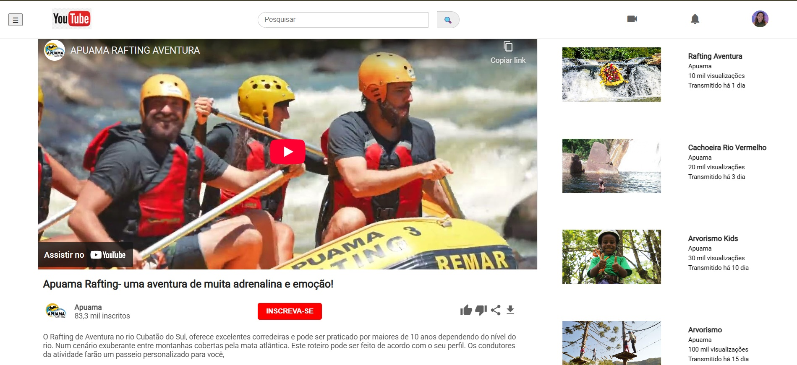

# 📺 Clone da Interface do YouTube

Este projeto é um clone da interface do YouTube, desenvolvido com **HTML5** e **CSS3**, seguindo princípios de **semântica, acessibilidade e responsividade**. O layout é baseado no [desafio proposto pela DIO](https://www.figma.com/design/lrRWUZPKnqMDZrSDJmZxUS/Desafio-de-Flexbox---DIO?node-id=0-1&p=f), utilizando o **Figma** como ferramenta de apoio visual.

## ✨ Funcionalidades

- ✅ Layout fiel ao protótipo do Figma
- ✅ Estrutura semântica com uso de `figure`, `section`, `aside`, `article`
- ✅ Ícones com Google Material Icons
- ✅ Design responsivo com media queries
- ✅ Acessibilidade com `alt`, `aria-label` e contraste adequado
- ✅ Fonte Roboto importada do Google Fonts

---

## 🖥️ Tecnologias Utilizadas

- HTML5
- CSS3 (Flexbox e Media Queries)
- Google Fonts
- Google Material Icons
- Figma (para seguir o design)

---

## 📷 Preview

> Imagem ilustrativa da interface com vídeo principal, barra de busca, header fixo e sugestões à direita.

---
## 👩‍💻 Autora

**Fernanda Linhares**  
Desenvolvedora Front-End em formação, com foco em acessibilidade, semântica e construção de interfaces modernas.  
 [LinkedIn](https://www.linkedin.com/in/fernanda-linhares-fbl/)

